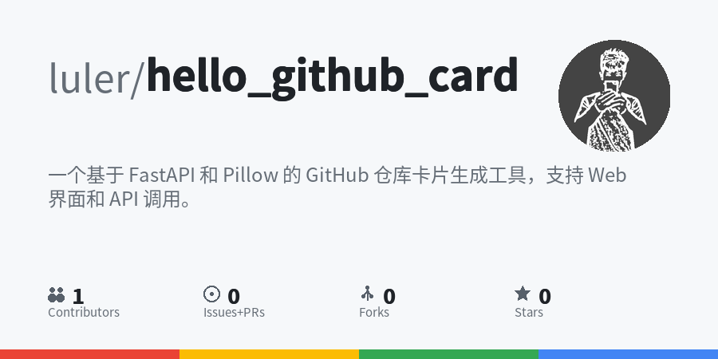

# GitHub 仓库卡片生成器

一个基于 FastAPI 和 Pillow 的 GitHub 仓库卡片生成工具，支持 Web 界面和 API 调用。

## ✨ 功能特性

- 🎨 生成精美的 GitHub 仓库信息卡片
- 📱 移动端完美兼容的 Web 界面
- 🚀 RESTful API 接口支持
- 🐳 Docker 一键部署
- 🖼️ 支持图片预览、放大查看和下载
- 😊 支持 Emoji 显示（彩色）
- 🌍 支持中英文混排
- 📊 显示仓库统计信息（Stars、Forks、Issues、Contributors）
- 🔄 自动清理旧图片，同一仓库只保留最新版本

## 📦 快速开始

### Docker 部署（推荐）

```bash
# 一键启动
docker-compose up -d

# 访问 http://localhost:8000
```

### 本地运行

```bash
# 安装依赖
pip install -r requirements.txt

# 启动服务
python api.py

# 访问 http://localhost:8000
```

## 🔌 API 使用

**POST** `/api/generate`
- 请求：
```json
{
  "repo_url": "https://github.com/luler/hello_github_card"
}
```
- 正常返回示例：
```json
{
  "success": true,
  "message": "卡片生成成功",
  "data": {
    "owner": "luler",
    "repo_name": "hello_github_card",
    "image_url": "/images/luler_hello_github_card_20251002_073207.png",
    "filename": "luler_hello_github_card_20251002_073207.png",
    "repo_info": {
      "description": "一个基于 FastAPI 和 Pillow 的 GitHub 仓库卡片生成工具，支持 Web 界面和 API 调用。",
      "stars": 0,
      "forks": 0,
      "issues": 0,
      "contributors": 1
    }
  }
}
```
- 错误返回示例：
```json
{
    "detail": "服务器错误: 404: 无法获取仓库信息，请检查仓库 URL 是否正确"
}
```

**GET** `/api/health` - 健康检查

详细文档：http://localhost:8000/docs

## 🎨 卡片样式



- **尺寸**: 900x450 像素
- **背景**: 浅灰色 (#f6f8fa)
- **头像**: 右上角圆形头像
- **标题**: 作者名（灰色）+ 仓库名（黑色加粗）
- **描述**: 最多 3 行，自动换行，支持 Emoji
- **统计**: Contributors、Issues、Forks、Stars
- **底部**: 彩色装饰条

## 🛠️ 技术栈

- **后端**: FastAPI, Uvicorn
- **图像处理**: Pillow
- **前端**: HTML/CSS/JavaScript
- **API**: GitHub REST API v3
- **部署**: Docker, Docker Compose
